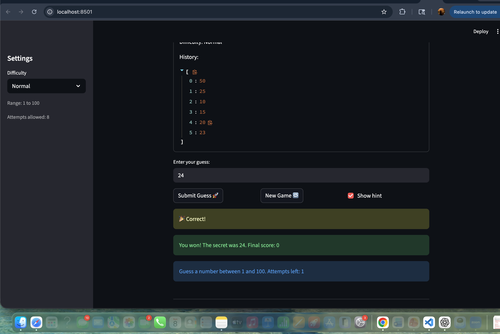

# 🎮 Game Glitch Investigator: The Impossible Guesser

## 🚨 The Situation

You asked an AI to build a simple "Number Guessing Game" using Streamlit.
It wrote the code, ran away, and now the game is unplayable. 

- You can't win.
- The hints lie to you.
- The secret number seems to have commitment issues.

## 🛠️ Setup

1. Install dependencies: `pip install -r requirements.txt`
2. Run the broken app: `python -m streamlit run app.py`

## 🕵️‍♂️ Your Mission

1. **Play the game.** Open the "Developer Debug Info" tab in the app to see the secret number. Try to win.
2. **Find the State Bug.** Why does the secret number change every time you click "Submit"? Ask ChatGPT: *"How do I keep a variable from resetting in Streamlit when I click a button?"*
3. **Fix the Logic.** The hints ("Higher/Lower") are wrong. Fix them.
4. **Refactor & Test.** - Move the logic into `logic_utils.py`.
   - Run `pytest` in your terminal.
   - Keep fixing until all tests pass!

## 📝 Document Your Experience

- [ ] Describe the game's purpose.
A number guessing game that challenges users/players to guess a randomly generated secret number. Players get hints after every number they guess until they win.

- [ ] Detail which bugs you found.
     - The secret number was resetting with every guess I made
     - Hints where very misleading. eg. I started from 5 and it kept telling me to go lower, I tried all numbers below 5 until 1 and it still told me to go lower. 
     - check_guess returned extra symbols/messages inconsistent with test expectations.
     - When I exhaust all my attempts or win, and click new game, it does not work. 

- [ ] Explain what fixes you applied.
	- Used st.session_state to store the secret number and prevent it from resetting.
	- Corrected logic in check_guess to return consistent messages.
	- Refactored core functions (check_guess, parse_guess, update_score) into logic_utils.py.
	-Updated scoring logic in update_score.
	- Verified fixes with pytest and manual testing in the live game.

## 📸 Demo

- [ ] [Insert a screenshot of your fixed, winning game here]

## 🚀 Stretch Features

- [ ] [If you choose to complete Challenge 4, insert a screenshot of your Enhanced Game UI here]
